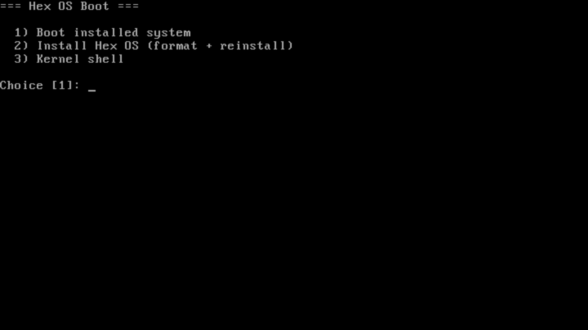
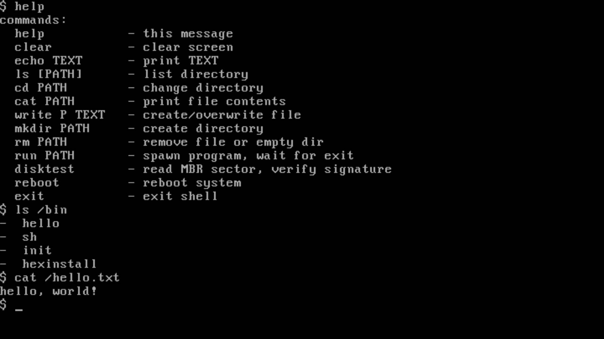
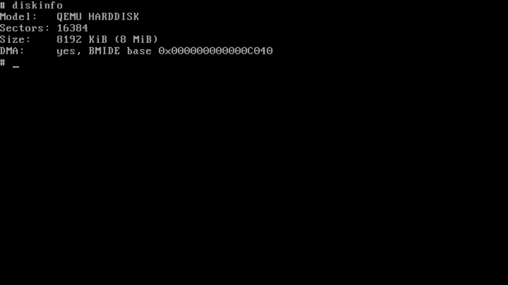
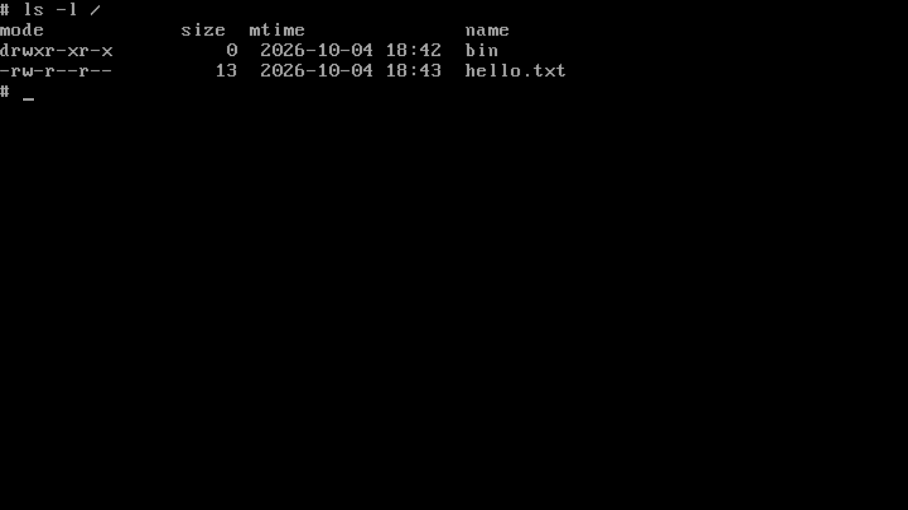

# HexOS

A small 64-bit operating system written from scratch in C and NASM.
Boots on x86-64 hardware via BIOS, runs in QEMU.



## What's inside

- **Bootloader**: single-stage MBR loader, E820 map, A20, long mode.
- **Kernel**: GDT/TSS, IDT, PIC, PIT (100 Hz), PS/2 keyboard, RTC, COM1.
- **Memory**: physical page allocator (bitmap) + kernel heap.
- **Drivers**: ATA PIO + bus-master DMA, PCI enumerator.
- **Filesystem**: HexFS v6 — inodes, indirect blocks, timestamps, mode/uid/gid.
- **Userspace**: ELF64 loader, ring 3, `int 0x80` syscalls, minimal libc.
- **Shells**: kernel shell (debug) and `/bin/sh` (user).
- **Installer**: `/bin/hexinstall` formats disk, installs system, writes MBR.

## Screenshots

| Boot menu | User shell |
|---|---|
|  |  |

| Kernel shell | HexFS |
|---|---|
|  |  |

## Build

Required tools: `nasm`, `gcc`, `ld`, `objcopy`, `ar`, `dd`, `qemu-system-x86_64`.

```sh
make deps        # check that everything is installed
make             # build os.img (8 MiB raw image)
```

## Run

```sh
make run           # QEMU with serial output on stdio
make run-nographic # QEMU without graphics window
make debug         # QEMU with -d int,cpu_reset -no-reboot
```

You will see a boot menu:

```
=== Hex OS Boot ===

  1) Boot installed system
  2) Install Hex OS (format + reinstall)
  3) Kernel shell

Choice [1]:
```

## Syscalls

`int 0x80`, DPL=3. Arguments in `rax` (number), `rdi`, `rsi`, `rdx`.

| # | Name | Args |
|---|---|---|
| 0 | exit | code |
| 1 | write | fd, buf, count |
| 2 | debug_num | n |
| 3 | open | path, flags |
| 4 | close | fd |
| 5 | read | fd, buf, count |
| 6 | lseek | fd, off, whence |
| 7 | list_dir | path, buf, max |
| 8 | mkdir | path |
| 9 | unlink | path |
| 10 | chdir | path |
| 11 | spawn | path |
| 12 | disk_read | lba, buf, count |
| 13 | disk_write | lba, buf, count |
| 14 | reboot | — |
| 15 | format | — |

## Layout

```
hex/
├── Makefile
├── link.ld            kernel linker script
├── user.ld            user program linker script
├── boot/boot.asm      MBR loader
├── arch/x86_64/       GDT, IDT, syscalls, usermode, scheduler
├── drivers/           ata, keyboard, pic, pit, irq, pci, rtc, serial
├── kernel/            kernel_main, console, memory, elf
├── fs/                HexFS v6
├── lib/               libhexc — userspace C library
├── user/              hello, shell, init, hexinstall
└── docs/              architecture, roadmap, screenshots
```

## Documentation

- [docs/ARCHITECTURE.md](docs/ARCHITECTURE.md) — how it works
- [docs/ROADMAP.md](docs/ROADMAP.md) — what's next

## License

GPL-3.0. See [LICENSE](LICENSE).
